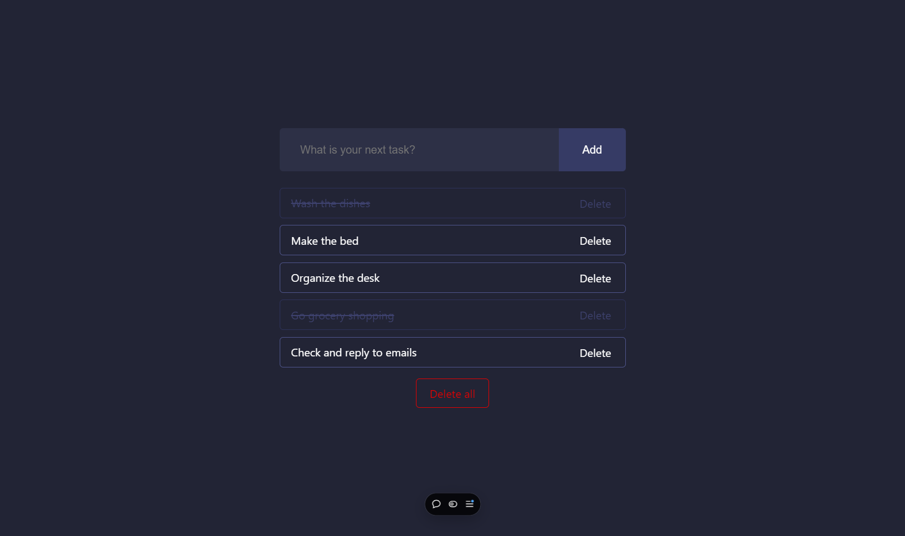

<h1>To Do List</h1>

<h2 align="left">Objetivo</h2>

 
Crie uma lista de tarefas a serem realizadas. Você poderá marcar as tarefas como concluídas, deletar cada uma tarefas e deletar todas as tarefas clicando em um único botão.

<h2 align="left">Descrição</h2>

 
Projeto desenvolvido de forma autônoma, com o objetivo de consolidar os conhecimentos obtidos nos estudos sobre React. O projeto é uma página web para criação de listas de tarefas e gestão das tarefas adicionadas.

<strong>Conceitos utilizados:</strong>

<ul>
  <li>Componentização</li>
  <li>Gestão de estados</li>
  <li>React Hooks</li>
  <li>Manipulação de arrays</li>
  <li>Estilização condicional</li>
</ul>

<h2 align="left">Ferramentas</h2>

Linguagens/ferramentas utilizadas:

